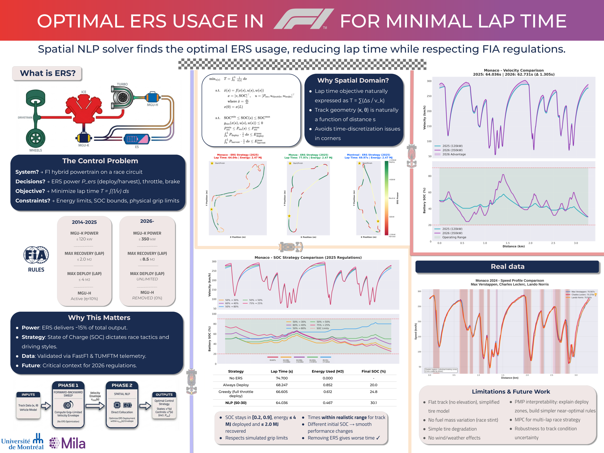

<h1 align="center">🏎️ F1 ERS Optimal Control</h1>

<p align="center">
  <strong>Optimal Energy Recovery System Usage in Formula 1 Hybrid Powertrains for Lap Time Minimization</strong>
</p>

<p align="center">
  <em>A physics-based optimization framework for computing lap-time-optimal ERS deployment strategies using forward-backward velocity profiling and spatial-domain nonlinear programming.</em>
</p>

---

<p align="center">
  
</p>

---

## 📋 Table of Contents

- [Overview](#overview)
- [Motivation & Goals](#motivation--goals)
- [Installation](#installation)
- [Quick Start](#quick-start)
- [The Experiment](#the-experiment)
- [Command Line Arguments](#command-line-arguments)
- [Data Sources](#data-sources)
- [Baseline Strategies](#baseline-strategies)
- [Generating Poster Plots](#generating-poster-plots)
- [Results & Outputs](#results--outputs)
- [Project Structure](#project-structure)
- [Technical Details](#technical-details)
- [Roadmap](#roadmap)
- [References](#references)

---

## Overview

This project implements a **two-phase hierarchical optimization** approach for Formula 1 Energy Recovery System (ERS) strategy:

1. **Phase 1 - Velocity Profiling**: A forward-backward solver computes the physics grip limit velocity envelope using vehicle dynamics and track geometry
2. **Phase 2 - ERS Optimization**: A spatial NLP (Nonlinear Programming) solver finds the optimal battery deployment/recovery strategy to minimize lap time

The framework supports both **2025 regulations** (120kW MGU-K, 4MJ deployment limit) and **upcoming 2026 regulations** (350kW MGU-K, 8.5MJ recovery, no MGU-H).

---

## Motivation & Goals

### Inspiration

Modern F1 cars are hybrid powertrains producing ~1000HP combined from:
- **Internal Combustion Engine (ICE)**: ~575kW (770HP)
- **MGU-K (Kinetic)**: 120kW electrical motor/generator
- **MGU-H (Heat)**: Unlimited power turbo recovery (removed in 2026)

The ERS system can deploy up to **4MJ per lap** but is limited in how much it can harvest (2MJ from braking). This creates a complex optimization problem: *when* and *where* should the driver deploy electrical power to minimize lap time?

### Goals Achieved

- **Validated Physics Models** - Implementation aligns with TUMFTM and Oxford academic approaches  
- **Forward-Backward Solver** - Computes grip-limited velocity profiles within 0.1s of real driver telemetry  
- **Spatial NLP Optimization** - Direct collocation with CasADi/IPOPT for globally optimal ERS deployment (higher order of Gauss-Legendre upgrade in the works)
- **New Regulation Support** - Compare 2025 vs 2026 powertrain regulations  
- **Real Telemetry Integration** - Loading actual F1 data via FastF1 API  
- **Baseline Strategy Comparison** - Evaluate rule-based strategies against optimal  
---

## Installation

### Prerequisites

- **Python** 3.10–3.12 (recommended: 3.11)
- **uv** (package manager by Astral) or pip
- Internet access (FastF1 downloads telemetry data)
- Optional: HSL MA97 linear solver for faster IPOPT performance

### Install with uv (Recommended)

```bash
# Install uv if you don't have it
curl -LsSf https://astral.sh/uv/install.sh | sh

# Clone the repository
git clone https://github.com/yourusername/f1-ers-optimal-control.git
cd f1-ers-optimal-control

# Create virtual environment and install dependencies
uv sync

# Set up FastF1 cache directory
mkdir -p data/cache
```

### Install with pip

```bash
# Clone and enter directory
git clone https://github.com/yourusername/f1-ers-optimal-control.git
cd f1-ers-optimal-control

# Create virtual environment
python -m venv .venv
source .venv/bin/activate

# Install dependencies
pip install -r requirements.txt

# Set up cache
mkdir -p data/cache
```

---

## Quick Start

### 1. Unified Startup (Recommended)

Run the full stack (Backend + Frontend) with a single command:

```bash
./start.sh
```

This will launch:
-   **Frontend**: http://localhost:5173
-   **Backend**: http://localhost:8000

**Optional Arguments:**
You can configure the ports if needed:
```bash
./start.sh --backend-port 8001 --frontend-port 3000
```

### 2. Manual CLI Usage

If you only want to run the optimization core (without the web UI), you can use the CLI directly:

#### Run the optimizer on Monaco (default)

```bash
uv run python main.py --track Monaco --plot
```

#### Run with animation output

```bash
uv run python main.py --track Monaco --plot --save-animation
```

NOTE: Saving animations is slow due to GIF encoding.

#### Compare 2025 vs 2026 regulations

```bash
# 2025 regulations (120kW ERS)
uv run python main.py --track Monza --regulations 2025 --plot

# 2026 regulations (350kW ERS)
uv run python main.py --track Monza --regulations 2026 --plot
```

#### Run multi-lap NLP race strategy

```bash
# 10-lap horizon with final and per-lap SOC constraints
uv run python main.py --track Monza --laps 10 --final-soc-min 0.45 --per-lap-final-soc-min 0.40
```

### Apple Silicon Note (M5 tested)

- Multi-lap NLP runs on Apple Silicon are supported, but can be much slower than high-end desktop x86 CPUs.
- On an M5 test machine, large multi-lap problems (especially with `--ds 5`) were also more crash-prone with Ipopt.
- Use `--nlp-solver auto` (default) so Apple Silicon prefers `fatrop`.
- If needed, reduce horizon size first (`--laps`) before increasing `--ds`.

```bash
# Recommended starting point on Apple Silicon
uv run python main.py --track Monza --ds 5 --laps 2 --nlp-solver auto
```

On first run, FastF1 will download session telemetry data to `data/cache/`. This may take a few minutes.

---

## The Experiment

### Problem Formulation

The optimization minimizes **lap time** in the spatial domain:

```
minimize    T = ∫(1/v)ds                    (lap time integral)

subject to: 
    v ≤ v_grip(s)                           (grip-limited velocity from Phase 1)
    dSOC/ds = f(P_ers, v, η)                (battery dynamics)
    ∫ P_deploy ds ≤ 4 MJ                    (regulatory deployment limit)
    ∫ P_harvest ds ≤ 2 MJ                   (regulatory recovery limit)
    SOC_min ≤ SOC ≤ SOC_max                 (battery health limits)
    |P_ers| ≤ P_max                         (power limits)
```

### Two-Phase Architecture

```
┌─────────────────────────────────────────────────────────────┐
│                    PHASE 1: Velocity Envelope                │
│  ┌─────────────┐    ┌──────────────────┐    ┌────────────┐  │
│  │ Track Data  │───▶│ Forward-Backward │───▶│ v_max(s)   │  │
│  │ (curvature) │    │     Solver       │    │ profile    │  │
│  └─────────────┘    └──────────────────┘    └────────────┘  │
└─────────────────────────────────────────────────────────────┘
                              │
                              ▼
┌─────────────────────────────────────────────────────────────┐
│                  PHASE 2: ERS Optimization                   │
│  ┌─────────────┐    ┌──────────────────┐    ┌────────────┐  │
│  │ v_max(s)    │───▶│  Spatial NLP     │───▶│ Optimal    │  │
│  │ + ERS cfg   │    │  (CasADi/IPOPT)  │    │ trajectory │  │
│  └─────────────┘    └──────────────────┘    └────────────┘  │
└─────────────────────────────────────────────────────────────┘
```

### Why Spatial Domain?

The spatial formulation (optimizing over distance `s` rather than time `t`) offers several advantages:

1. **Fixed endpoint**: Track length L is known; lap time T is what we're minimizing
2. **Natural constraints**: Curvature κ(s), track width, banking are functions of position
3. **No singularities** (for racing): Minimum speeds ~50 km/h avoid 1/v divergence
4. **Computational efficiency**: Significant speedups reported by TUMFTM

---

## Command Line Arguments

```bash
python main.py [OPTIONS]
```

| Argument | Type | Default | Description |
|----------|------|---------|-------------|
| `--config` | path | `None` | Load defaults from a JSON/YAML config file |
| `--track` | str | `Monaco` | Track name (Monaco, Monza, Spa, Montreal, Silverstone) |
| `--year` | int | `2024` | Season year for FastF1 telemetry data |
| `--driver` | str | `None` | Driver code (VER, HAM, LEC, etc.) - uses fastest if not specified |
| `--initial-soc` | float | `0.5` | Initial battery state of charge (0.0-1.0) |
| `--final-soc-min` | float | `0.3` | Minimum final SOC constraint (0.0-1.0) |
| `--ds` | float | `5.0` | Spatial discretization step in meters |
| `--laps` | int | `1` | Number of consecutive laps in the NLP horizon |
| `--per-lap-final-soc-min` | float | `None` | Optional SOC floor at each lap boundary |
| `--regulations` | str | `2025` | Regulation set: `2025` or `2026` |
| `--collocation` | str | `euler` | Integration method: `euler`, `trapezoidal`, `hermite_simpson` |
| `--nlp-solver` | str | `auto` | NLP backend: `auto`, `ipopt`, `fatrop`, or `sqpmethod` |
| `--ipopt-linear-solver` | str | `mumps` | Ipopt linear solver backend (advanced) |
| `--ipopt-hessian` | str | `limited-memory` | Ipopt Hessian mode: `limited-memory` or `exact` |
| `--flying-lap/--no-flying-lap` | flag | `True` | Continuous lap (no standing start) |
| `--use-tumftm/--no-use-tumftm` | flag | `False` | Prefer TUMFTM raceline if available |
| `--plot/--no-plot` | flag | `True` | Enable or disable visualization plots |
| `--save-animation/--no-save-animation` | flag | `False` | Enable or disable animated lap visualization |
| `--solver` | str | `nlp` | Solver type (nlp is fully implemented) |

### Examples

```bash
# Load settings from a config file
python main.py --config docs/configs/example.yaml

# Monaco with specific driver
python main.py --track Monaco --driver LEC --plot

# Monza with aggressive energy use (start at 60%, end at 40%)
python main.py --track Montreal --initial-soc 0.6 --final-soc-min 0.4 --plot

# Spa with 2026 regulations
python main.py --track Spa --regulations 2026 --plot --save-animation

# Multi-lap stint optimization (race strategy)
python main.py --track Monza --laps 12 --initial-soc 0.55 --final-soc-min 0.45 --per-lap-final-soc-min 0.35

# Auto backend mode (fatrop on Apple Silicon, ipopt otherwise)
python main.py --track Monza --ds 5 --laps 10 --nlp-solver auto

# Use TUMFTM raceline instead of FastF1
python main.py --track Monaco --use-tumftm --plot

# Compare collocation methods (accuracy vs speed tradeoff)
python main.py --track Monaco --collocation euler --plot           # Fast, 1st order
python main.py --track Monaco --collocation trapezoidal --plot     # Balanced, 2nd order  
python main.py --track Monaco --collocation hermite_simpson --plot # Accurate, 4th order
```

### Preset + Config Precedence

Resolution order is:

1. Built-in defaults
2. Config file (`--config`)
3. Explicit CLI flags (highest priority)

### Config File Format

Use JSON or YAML with keys that match CLI flag names (without the `--`).

```yaml
track: Monza
year: 2024
initial_soc: 0.55
final_soc_min: 0.45
collocation: trapezoidal
```

---

## Data Sources

The project supports two primary data sources, and **the choice significantly affects results**:

### 1. FastF1 Telemetry (Default)

Real telemetry data from official F1 timing:

```python
track.load_from_fastf1(driver='VER')
```

- **Pros**: Real GPS coordinates, actual driver speed profiles, sector times
- **Cons**: GPS noise in curvature calculation, varies by session/driver
- **Best for**: Comparing against real performance, specific track configurations

### 2. TUMFTM Racelines

Minimum-curvature optimal racing lines from [TUMFTM's racetrack database](https://github.com/TUMFTM/racetrack-database):

```python
track.load_from_tumftm_raceline('data/racelines/monaco.csv')
```

- **Pros**: Smoother curvature, theoretically optimal racing line
- **Cons**: May not match actual F1 racing line (different constraints)
- **Best for**: Pure optimization studies, comparing strategies

### Critical: SOC Boundaries Affect Results Dramatically

The initial and final State of Charge constraints fundamentally change the optimization:

| Strategy | Initial SOC | Final SOC | Behavior |
|----------|-------------|-----------|----------|
| Qualifying | 90% | 20% | Maximum deployment, don't save energy |
| Race (aggressive) | 50% | 30% | Deploy more than harvest |
| Race (conservative) | 50% | 50% | Charge-sustaining, balanced |
| Undercut prep | 50% | 80% | Harvest mode, prepare for attack |

```bash
# Qualifying setup (use all energy)
python main.py --track Monaco --initial-soc 0.9 --final-soc-min 0.2 --plot

# Conservative race strategy
python main.py --track Monaco --initial-soc 0.5 --final-soc-min 0.5 --plot
```

---

## Baseline Strategies

Compare the optimal NLP solution against rule-based strategies:

```bash
python scripts/compare_baselines.py
```

### Available Strategies

| Strategy | Description | Typical Gap to Optimal |
|----------|-------------|------------------------|
| **Offline Optimal** | NLP-computed globally optimal trajectory | Reference |
| **Optimal Tracking** | Follows NLP trajectory with feedback control | +0.05–0.1s |
| **Smart Heuristic** | Deploy on straights when grip available, harvest when braking | +0.3–0.8s |
| **Target SOC** | Proportional deployment based on SOC deviation from target | +0.5–1.0s |
| **Greedy (KERS)** | Deploy during hard acceleration, harvest during braking | +0.8–1.5s |
| **Always Deploy** | Deploy whenever accelerating and have charge | +1.0–2.0s |

### Why Are Baselines Slower Even With ERS?

A critical insight from this project:

> **Baselines with ERS are often slower than the optimal solution without additional ERS power.**

This happens because:

1. **Grip-Limited Acceleration**: Deploying ERS power in corners where tires are already at the grip limit provides **zero benefit** and wastes energy. The optimal solver knows exactly where grip headroom exists.

2. **Velocity Profile Mismatch**: Baseline strategies track a reference velocity but use feedback control with inherent lag. The optimal solution jointly optimizes velocity and energy.

3. **Energy Timing**: Deploying ERS 50m too early or too late on a straight can cost 0.1s. The NLP precisely times deployment to maximize velocity gain per joule.

4. **Cumulative Errors**: Small suboptimalities compound. A baseline making 20 "almost right" decisions loses to the globally optimal solution.

---

## Generating Poster Plots

Generate publication-quality visualizations:

```bash
# Generate all individual poster plots
python visualization/poster_plots.py

# Output saved to: figures/poster_plots/
```

### Available Poster Plots

| Plot | Filename | Description |
|------|----------|-------------|
| Track ERS Layout | `track_{name}_ers_layout.png` | Track map colored by ERS power |
| SOC Strategies | `soc_strategies_overlapped.png` | Compare different SOC constraints |
| Regulation Velocity | `regulation_velocity_comparison.png` | 2025 vs 2026 speed profiles |
| Regulation ERS | `regulation_ers_comparison.png` | Power deployment comparison |
| Lap Time Bars | `soc_strategies_laptime_comparison.png` | Bar chart of strategy performance |

### Driver Speed Profile Comparison

```bash
# Compare multiple drivers
python visualization/plot_driver_speed_profile.py \
    --track Monaco --year 2024 \
    --drivers VER LEC NOR \
    --save monaco_drivers_comparison.png
```

---

## Results & Outputs

### Output Directory Structure

Results are organized by track and timestamp:

```
results/
└── monaco/
    └── 20240115_143022/
        ├── summary.txt              # Human-readable results summary
        ├── data/
        │   ├── results_summary.json # Complete results as JSON
        │   ├── distance.npy         # Numpy arrays for analysis
        │   ├── velocity_optimal.npy
        │   ├── velocity_no_ers.npy
        │   ├── velocity_with_ers.npy
        │   ├── soc_optimal.npy
        │   ├── ers_power.npy
        │   ├── throttle.npy
        │   └── brake.npy
        └── plots/
            ├── 01_track_analysis.png
            ├── 02_offline_solution.png
            ├── 03_ers_comparison.png
            ├── 04_simple_results.png
            └── 05_lap_animation.gif  # If --save-animation
```

### Key Metrics

The solver reports:

- **Lap Times**: No ERS / With ERS / Optimal
- **Time Improvement**: Seconds gained vs. baseline
- **Energy Usage**: Deployed / Recovered / Net (MJ)
- **SOC Trajectory**: Initial → Final, swing range
- **Solver Performance**: Convergence status, solve time

### Example Output

```
========================================================================
F1 ERS OPTIMIZATION RESULTS - MONACO
========================================================================
Regulations Year:      2025

TRACK INFORMATION:
Track:                 Monaco
Total Length:          3337 m
Number of Segments:    668

LAP TIME PERFORMANCE:
Lap Time (No ERS):      75.432 s
Lap Time (With ERS):    74.891 s
Lap Time (Optimal):     74.956 s

Improvement vs No ERS:  0.476 s (0.63%)
Gap to Theoretical:     0.065 s

ENERGY MANAGEMENT:
Initial SOC:            50.0%
Final SOC:              32.1%
Energy Deployed:        2.847 MJ
Energy Recovered:       1.923 MJ
Net Energy Used:        0.924 MJ
========================================================================
```

---

## Project Structure

```
f1-ers-optimal-control/
├── main.py                 # Entry point
├── config/
│   ├── __init__.py
│   ├── ers.py              # ERS regulations (2025/2026)
│   └── vehicle.py          # Vehicle parameters, tire model
├── models/
│   ├── __init__.py
│   ├── track.py            # Track loading (FastF1/TUMFTM)
│   └── vehicle_dynamics.py # Physics model (CasADi)
├── solvers/
│   ├── __init__.py
│   ├── base.py             # Base classes, OptimalTrajectory
│   ├── forward_backward.py # Grip-limited velocity solver
│   └── spatial_nlp.py      # CasADi/IPOPT optimization
├── strategies/
│   ├── __init__.py
│   ├── base.py             # BaseStrategy interface
│   └── baselines.py        # Rule-based strategies
├── simulation/
│   ├── __init__.py
│   └── lap.py              # Time-domain simulation
├── visualization/
│   ├── __init__.py
│   ├── track_viz.py
│   ├── results_viz.py
│   ├── animation.py
│   ├── poster_plots.py
│   └── plot_driver_speed_profile.py
├── scripts/
│   └── compare_baselines.py
├── utils/
│   ├── __init__.py
│   └── run_manager.py      # Results organization
├── data/
│   ├── cache/              # FastF1 cache (created on first run)
│   └── racelines/          # TUMFTM racelines (optional)
├── results/                # Output directory
├── figures/                # Generated plots
├── docs/
│   └── poster.png          # Project poster
├── pyproject.toml
├── uv.lock
└── README.md
```

---

## Technical Details

### Vehicle Model

Based on [TUMFTM's laptime-simulation](https://github.com/TUMFTM/laptime-simulation):

| Parameter | 2025 Value | 2026 Value | Unit |
|-----------|------------|------------|------|
| Mass (with driver) | 798 | 768 | kg |
| ICE Power | 575 | 400 | kW |
| MGU-K Power | 120 | 350 | kW |
| Deployment Limit | 4.0 | Unlimited | MJ/lap |
| Recovery Limit | 2.0 | 8.5 | MJ/lap |
| Battery Capacity | 4.5 | 4.5 | MJ |

### Tire Model

Friction circle with load-dependent coefficients:

```
μ(Fz) = μ₀ + (dμ/dFz) × (Fz - Fz₀)
```

| Parameter | Front | Rear |
|-----------|-------|------|
| μx (longitudinal) | 1.65 | 1.95 |
| μy (lateral) | 1.85 | 2.15 |
| dμ/dFz | -5×10⁻⁵ | -5×10⁻⁵ |

### Solver Configuration

The spatial NLP uses:
- **Transcription**: Direct collocation (selectable order)
- **NLP Solver**: IPOPT with MA97 or MUMPS linear solver
- **Discretization**: 5m spatial steps (typically 500-1000 nodes per lap)
- **Tolerances**: 1×10⁻⁴ (optimal), 1×10⁻³ (acceptable)

#### Collocation Methods

| Method | Order | Formula | Use Case |
|--------|-------|---------|----------|
| **Euler** | 1st | `x[k+1] = x[k] + h·f(x[k])` | Fast prototyping, coarse solutions |
| **Trapezoidal** | 2nd | `x[k+1] = x[k] + (h/2)·(f[k] + f[k+1])` | Good balance of speed/accuracy |
| **Hermite-Simpson** | 4th | Simpson's rule with Hermite midpoint | High accuracy, publication quality |

The Hermite-Simpson method uses the separated form:
```
x_mid = (x[k] + x[k+1])/2 + (h/8)·(f[k] - f[k+1])     # Hermite interpolation
x[k+1] = x[k] + (h/6)·(f[k] + 4·f_mid + f[k+1])       # Simpson quadrature
```

**Recommendation**: Use `--collocation trapezoidal` for general use, `--collocation hermite_simpson` for final results or when comparing against real telemetry.

---

## Roadmap

### Modeling Fidelity

- [ ] **Dynamic Tire Model**: Upgrade the static "friction circle with load-dependent coefficients" to include thermal degradation and wear factors for multi-lap accuracy.
- [ ] **3D Track Geometry**: Integrate elevation and banking data to improve the accuracy of the "vehicle dynamics and track geometry" constraints.

### Analysis & Validation

- [ ] **Sensitivity Analysis**: Create a script to sweep parameters (mass, drag, grip) and plot their impact on lap time and optimal ERS usage.
- [ ] **Validation Overlays**: Add an automated plot comparing the "Optimal" velocity profile directly against the loaded "FastF1" telemetry to visually quantify.

### Tooling & Reproducibility

- [ ] **Docker Support**: Containerize the environment to standardize the installation of `uv`, `ipopt`, and linear solvers (MA97/MUMPS) across different operating systems.

### Strategy & Learning

- [ ] **Race Strategy Solver**: Expand the "Multi-lap stint optimization" to include stint-level tire-compound choices.
- [ ] **RL**: hybrid residual model-based RL

---


## References

### Academic Sources

1. **Limebeer & Perantoni** (2014) - "Optimal control for a Formula One car with ERS"
2. **TUMFTM** - [laptime-simulation](https://github.com/TUMFTM/laptime-simulation), [trajectory_planning_helpers](https://github.com/TUMFTM/trajectory_planning_helpers)
3. **Dal Bianco et al.** - Quasi-steady-state lap time simulation
4. **Heilmeier et al.** (2020) - "Application of Monte Carlo Methods to Race Simulation"

### Validation

The implementation follows methodologies validated against:
- Real driver telemetry (within 0.1-0.5s)
- Published F1 results
- TUMFTM race simulation results

---


<p align="center">
  <em>🏁</em>
</p>
